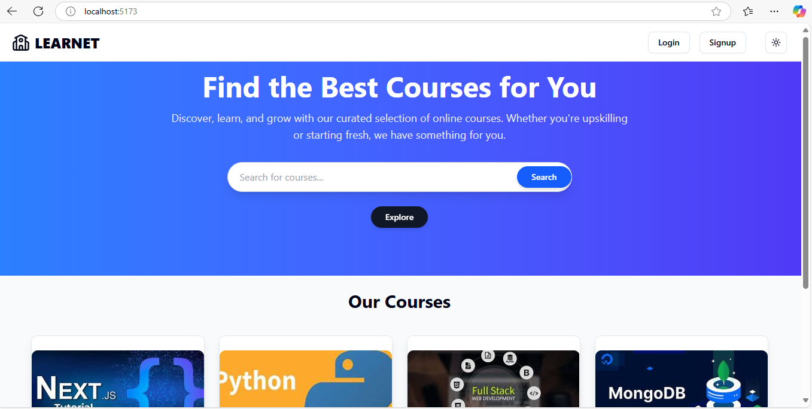
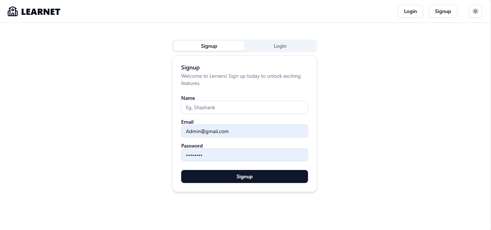
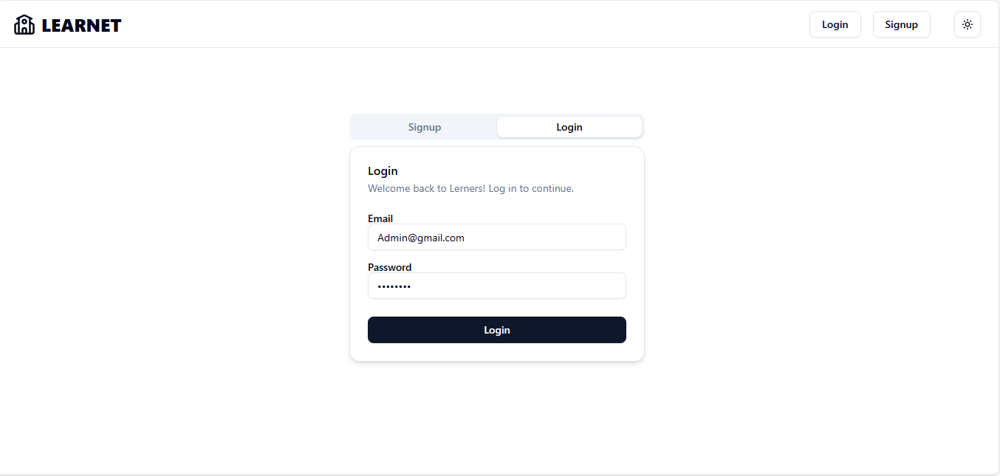
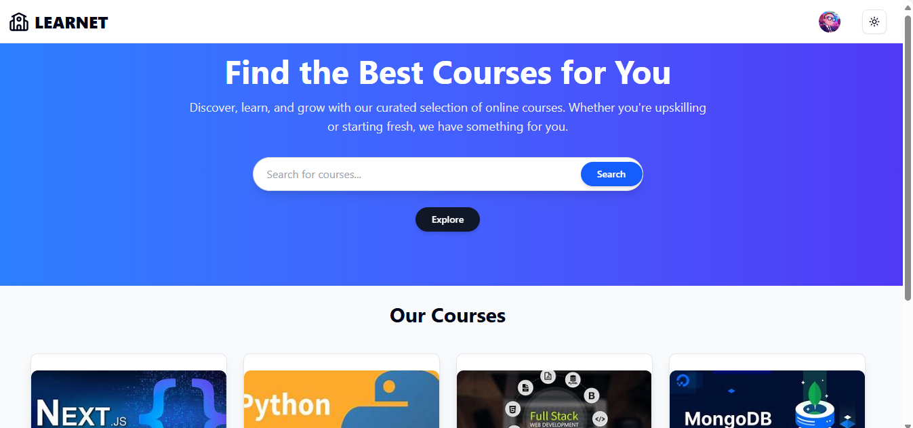
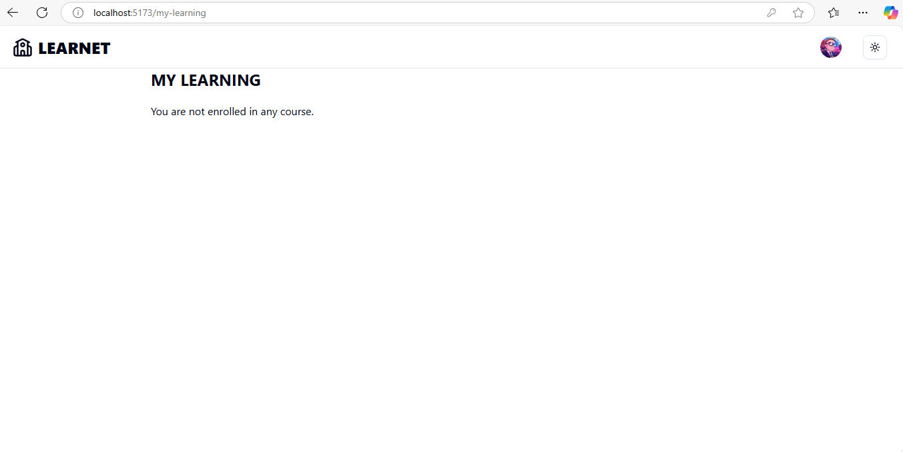
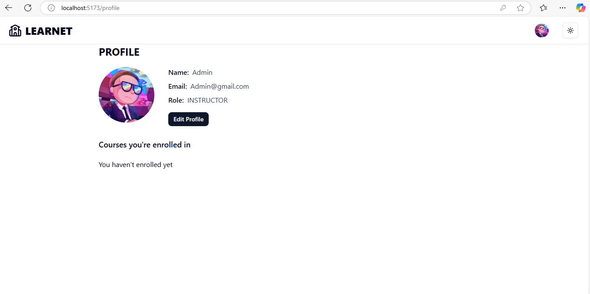
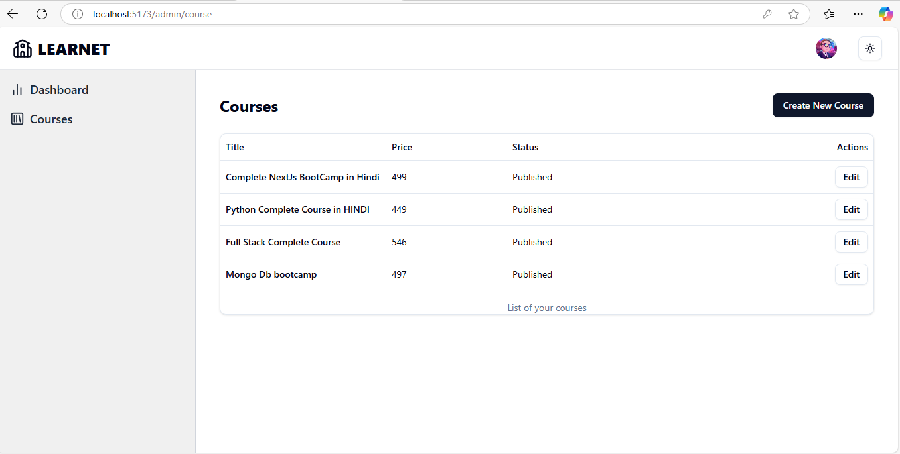
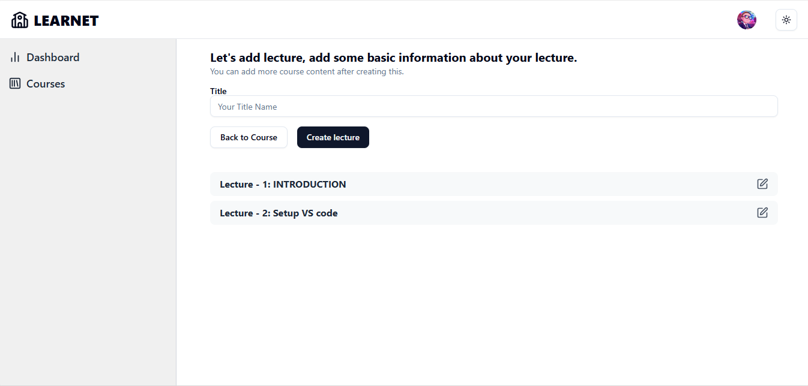
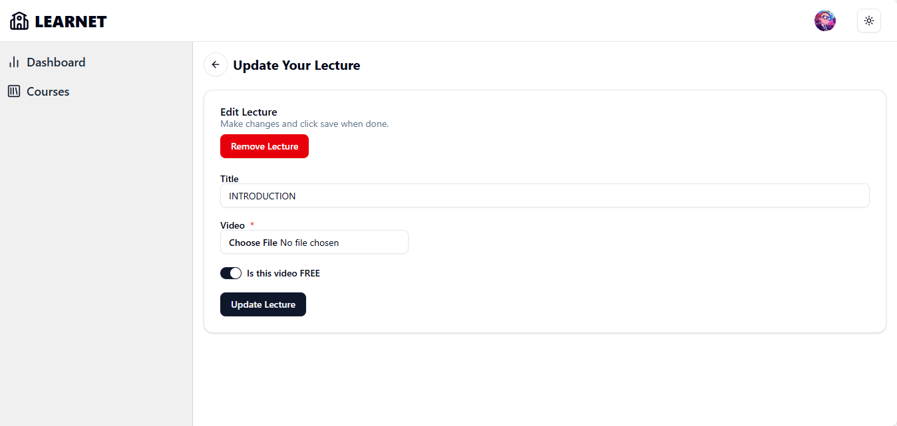

# Learnet - MERN Stack E-Learning Platform

**Learnet** is a full-featured e-learning platform built using the **MERN stack** (MongoDB, Express.js, React, Node.js). It allows instructors to create and publish courses, and students to browse, enroll, and learn from them.

---
🎓 This project is a part of my learning journey as an MCA student, built to explore and implement full-stack development concepts using the MERN stack.
---
## 🚀 Features

- 🔐 **Authentication**
  - Secure login & registration
  - Role-based access for Students & Instructors

- 🎓 **Course Management**
  - Instructors can create, edit, and publish courses
  - Add video lectures and descriptions
  - Draft and publish modes

- 👨‍🏫 **Student Dashboard**
  - Enrolled courses
  - Lecture progress tracking

- 🌐 **Responsive UI**
  - Built using React + Tailwind CSS
  - Mobile-first and intuitive design

- 📦 **API Integration**
  - Built with RESTful APIs using Express and MongoDB
  - Integrated with Cloudinary for video/image storage

---

## 🛠️ Tech Stack

| Frontend | Backend | Database | Other |
|----------|---------|----------|-------|
| React.js | Node.js | MongoDB  | Cloudinary (media), Express.js, RTK Query |

---

## 📁 Folder Structure

---

## 📷 Screenshots

Below are some UI previews from the project:

---

## 📌 Note

This project is under active development. More features and polish are coming soon!

---

## 🙌 Contributing

Pull requests are welcome. For major changes, please open an issue first to discuss what you would like to change.

